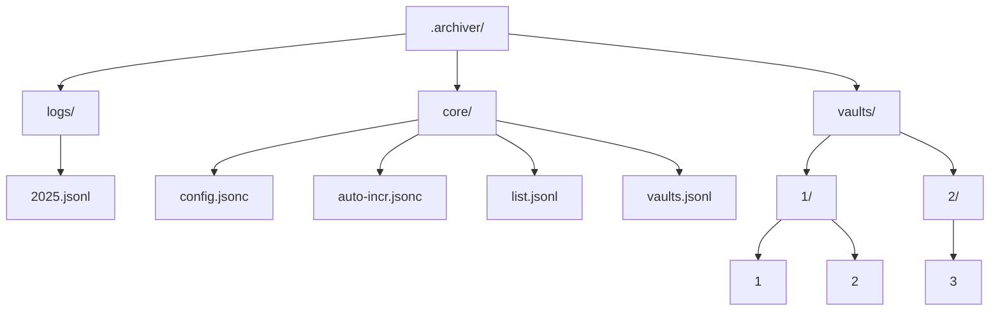

# Archiver

Troubled with too many projects? Cannot focus on your current work?

**Archiver helps you now!**

Archiver is a command line tool that helps you manage your unused but still cannot be removed files and directories. You can use `put` to move items into Archiver, and `restore` to move them back. You can also use `list` to see what you have archived, and `vault` to group your archived items.

## Installation

Install script recommended （supports Linux/macOS）

<details>
  <summary>_Does not support Windows yet_ (click to show why)</summary>
    <p>The code itself is Windows compatible, but it is weired to use command line tools in Windows. And I am not supposed to make a gui for it.</p>
    <p>If you are windows users, you can use WSL to run Archiver (just like I did).</p>
</details>
<br>

```bash
curl -fsSL https://github.com/baendlorel/archiver/blob/release/archiver-installer.sh | sh
```

## Where does the files go?

Archived files are stored in `~/.archive` where `~` means home directory.

`.archiver` structure is as follows:



# Commands

You can use following commands to manage your archived items.

## Put

Put a file/directory into the archive.

Just get into a directory, run this command and you can move your target into `.archive`.

- Archived target will be given an unique id. The id is auto incremental.

```bash
# also `arv p`
arv put <items>
arv put temp1.txt temp2.txt temp3
```

### option: --vault/-v

Put the archived items into a specific vault. Shall fail if the vault does not exist.

```bash
arv put --vault <vault-name> <items>
arv put -v myvault temp1.txt temp2.txt
```

### option: --message/-m

You can tell why you archive it by using this option.

```bash
arv put <item> --message xxx
```

## Restore

Move archived files/directories back to where they came from.

- Will fail if there is an object with the same name, or archived file is missing

- `<ids>` can be obtained from the `list` command

- The restored targets will be hidden when executing `list` command, unless you use `list --all`.

```bash
# also `arv r` or `arv rst`
arv restore <ids>
arv restore 4 5 6
```

## Move

Move archived items to a different vault.

```bash
# also `arv m`, `arv mv` or `arv mov`
arv move <ids> --to <vault-name>
arv move 1 2 3 -t myvault
```

## Vault

Manage vaults, which are used to group archived items.

### use

Change the current vault. Default vault is `@` with internal vault id `0`.

```bash
# also `arv v` or `arv vlt`
arv vault use <vault-name>
```

### create

```bash
arv vault create <vault-name> --message <message>
arv vlt create myvault -m "This is my vault"
```

#### option: --remark/-r

Add a remark to the vault. This will be shown in the `arv vault list` command.

#### option: --activate/-a

Activate the vault. This means the created vault will be used as the current vault.

### list

```bash
# also `arv vlt ls`
arv vault list # Show only valid vaults
arv vault list --all # Show all vaults
```

### remove

Remove a vault. Archived items in this vault will be moved to the default vault `@`.

```bash
# also `arv vlt rm xxx`
arv vault remove <vault-name>
```

### recover

When you want to use the same name as removed vault, use this.

```bash
arv vault recover <vault-name>
```

## List

Show all entries in the archive.

- The list will contain archived time, id, target name and original directory
- If the target is a directory, its name will be shown in blue

```bash
# also `arv l` or `arv ls`
arv list
```

### option: --all

Show all archived records, including the restored ones.

```bash
# also `arv ls -a`
arv list --all
```

### option: --restored

Show restored records.

```bash
# also `arv ls -r`
arv list --restored
```

### option: --vault

Show records in a specific vault.

```bash
# also `arv ls -v myvault`
arv list --vault <vault-name>
```

## Log

Show the logs of `put`, `restore`, and `config` operations.

`[range]` is optional. It means showing logs within a specific period of time. It can take the following forms:

1. normal ranges : `YYYYMM-YYYYMM`
2. left side only : `YYYYMM`
3. Common Era only
4. Archiver will always consider the last 2 digits of the number as the month, and the rest as the year.

```bash
# also `arv lg 20250101`
arv log [range]
```

### option: --id

Show logs of a specific id. Will display related list and vault records.

```bash
# also `arv lg -i 123`
arv lg --id <log-id>
```

## Config

Display or modify configurations.

### list

```bash
arv config list # show all configs
```

### alias

Aliases will shorten the paths shown in command `list` and `log`. However, Archiver will still keep the full version. This is just for display purposes.

```bash
arv config alias <alias>=<absolute-path>
arv config alias mytemp=/etc/aa
arv config alias --remove mytemp=/etc/aa
```

### update-check

Will check for updates automatically when you run the non-display commands. Default value is `on`. If you want to disable this feature, you can set it to `off`.

```bash
arv config update-check off
```

### vault-item-sep

Will change the separator between vault name and item name in the `list` or other commands. Default value is `:`. You can change it to any character you like.

```bash
arv config vault-item-sep <character>
```

## Update

Check whether there is a newer version of Archiver. If there is, it will be downloaded and installed automatically.

_Internet connection required!_

```bash
arv update
```

## Check

Checking whether the core files of Archiver is logically valid. Will show errors and advise you to fix them.

By default, it will only display the entries that do not pass the check.

Checks include:

1. Home dir, `.archiver` dir, current working dir, logs dir, core dir, vaults dir is valid
2. Config file is valid
3. Archived item all exist and matches the list file
4. Vaults exist and match the vaults list
5. Auto-increment file is correct
6. No duplicated ids

```bash
arv check
```

### option: --verbose/-v

Show the passed checks.

## Help

Show help information for all commands.

```bash
arv help
```
